# Gestor de Tareas (Task Manager)

**Desarrollado por:** Valeria Guillén valeria.mgl@outlook.com  
**Taller de Java Hitss TV**

## Descripción del Proyecto

Aplicación CRUD para gestionar tareas personales, desarrollada con Spring Boot para aprender los fundamentos de desarrollo web con Java. El proyecto implementa controladores, servicios, repositorios, entidades y uso de base de datos MySQL, siguiendo lo que se vio en el taller.

## Objetivo del Proyecto

Crear una aplicación CRUD para gestionar tareas personales, aprendiendo los fundamentos de Spring Boot, como controladores, servicios, repositorios, entidades, y uso de base de datos.

## Funcionalidades Básicas

1. Crear una tarea
2. Listar todas las tareas
3. Actualizar una tarea
4. Eliminar una tarea

## Entidades Principales

- **Task**: Representa una tarea con sus atributos y métodos
- **User**: Representa un usuario del sistema
- **Role**: Representa el rol de un usuario (USER, ADMIN)

## Endpoints REST (TaskController)

| MÉTODO | RUTA | DESCRIPCIÓN |
| :--- | :--- | :--- |
| GET | /tasks | Listar todas las tareas |
| GET | /tasks/{id} | Obtener una tarea específica |
| POST | /tasks | Crear una nueva tarea |
| PUT | /tasks/{id} | Actualizar una tarea |
| DELETE | /tasks/{id} | Eliminar una tarea |

## Características del Proyecto

- Uso de anotaciones: `@RestController`, `@Service`, `@Repository`, `@Entity`, etc.
- Validaciones implementadas
- CRUD con Spring Data JPA
- Base de datos MySQL
- Manejo de errores básicos
- Spring Security con JWT (gestión de usuarios y roles)
- Dos tipos de usuarios (USER, ADMIN):
  - Usuario USER: puede crear tareas y visualizarlas
  - Usuario ADMIN: puede realizar todas las operaciones CRUD
- API documentada con Swagger
- Pruebas con Postman (opcional)

## Configuración del Proyecto

1. Clonar el repositorio
2. Configurar la base de datos MySQL en `application.properties`
3. Ejecutar el proyecto con Maven: `./mvn spring-boot:run`
4. Acceder a la aplicación en `http://localhost:8080`
5. La documentación de la API está disponible en `http://localhost:8080/swagger-ui.html`

## Documentación Swagger

A continuación se muestran capturas de pantalla de la interfaz de Swagger UI donde se documentan los endpoints de la API:

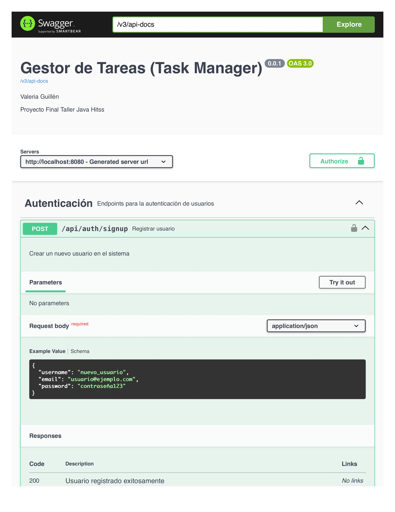
*Imagen inicial de Swagger UI mostrando la interfaz de documentación de la API*

*Endpoint GET para listar todas las tareas*

*Endpoint GET para obtener una tarea específica por ID*

*Endpoint POST para crear una nueva tarea*

*Endpoint PUT para actualizar una tarea existente*

*Endpoint DELETE para eliminar una tarea*

*Detalles del modelo de datos Task*

*Autenticación y seguridad en Swagger*

*Ejemplo de parámetros para las operaciones*

*Modelos de datos utilizados en la API*

*Opciones de autorización en los endpoints*

*Ejemplos de respuestas de la API*

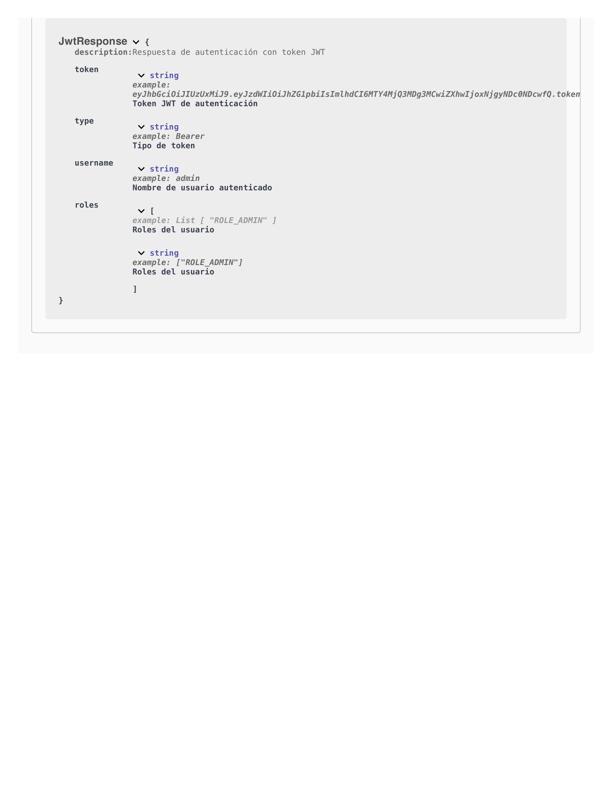
*Configuración adicional de la API*

## Pruebas con Postman

A continuación se muestran capturas de pantalla de las pruebas realizadas con Postman para validar el funcionamiento de la API:

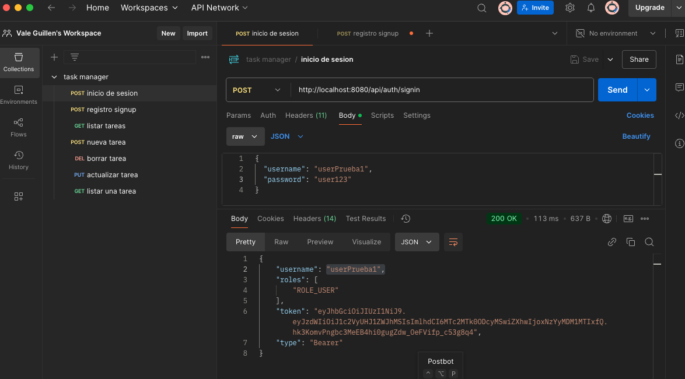
*Ejemplo de inicio de sesión (login) exitoso en la aplicación*

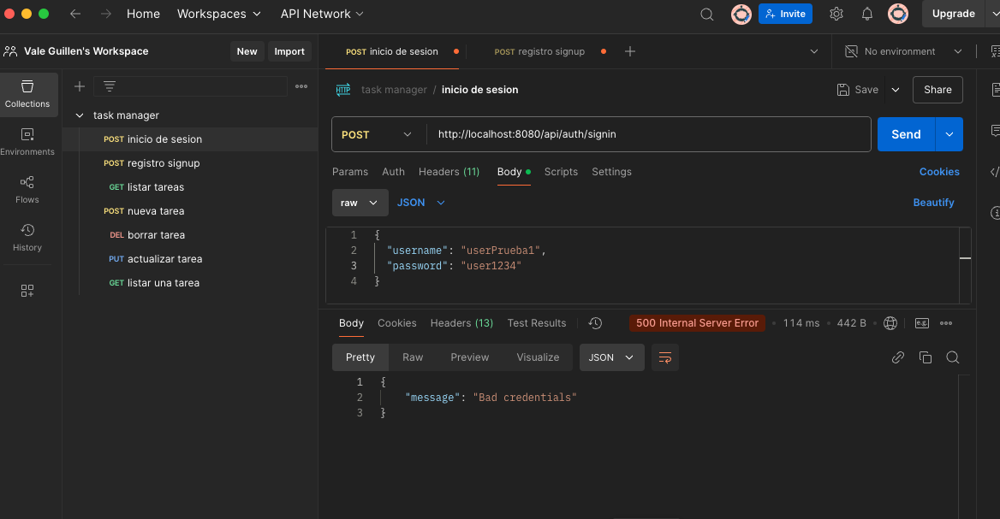
*Ejemplo de inicio de sesión (login) fallido con mensaje de error*

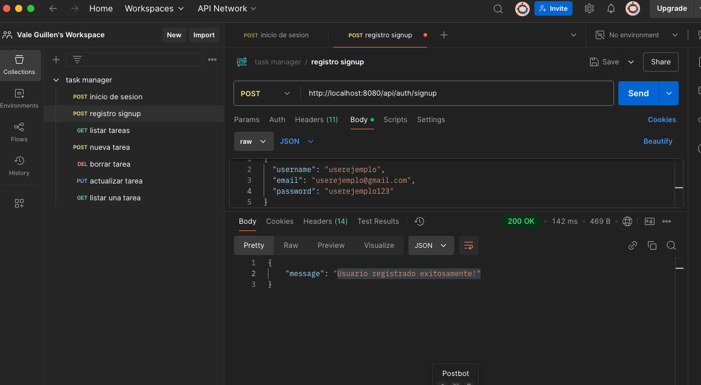
*Ejemplo de registro de usuario exitoso*

*Ejemplo de error de registro cuando el nombre de usuario ya está en uso*

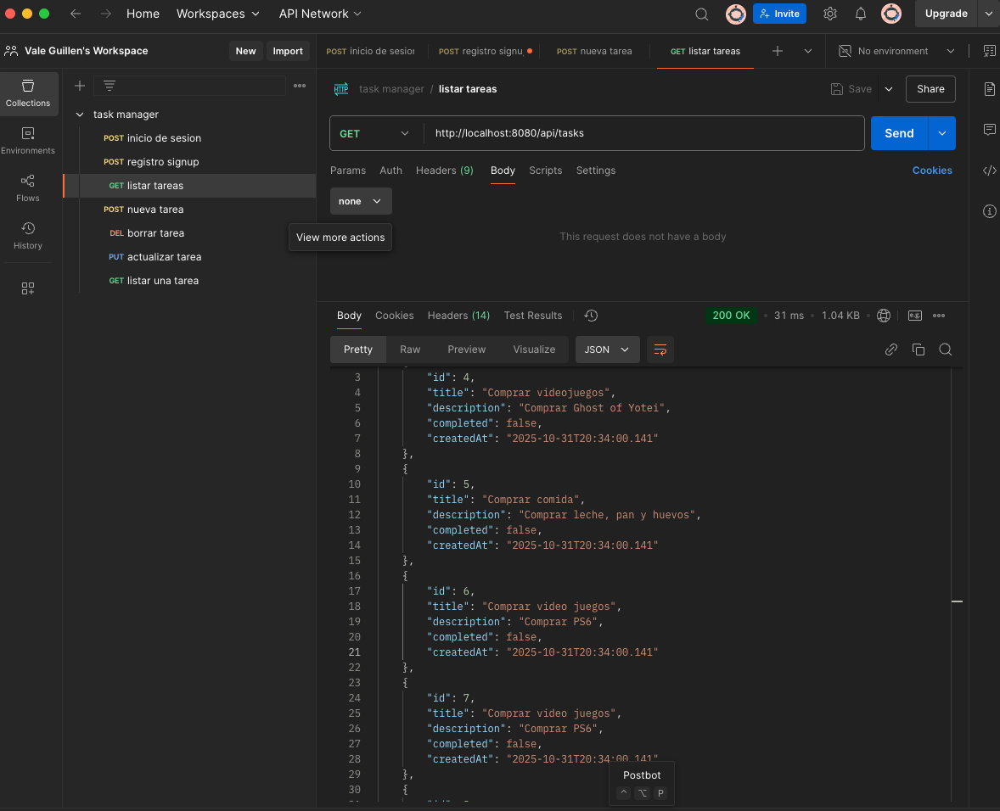
*Ejemplo de obtención exitosa de la lista de tareas*

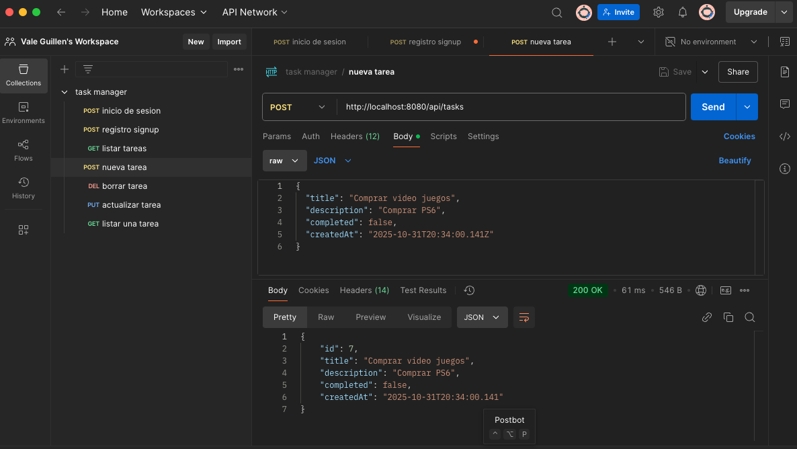
*Ejemplo de creación exitosa de una nueva tarea*

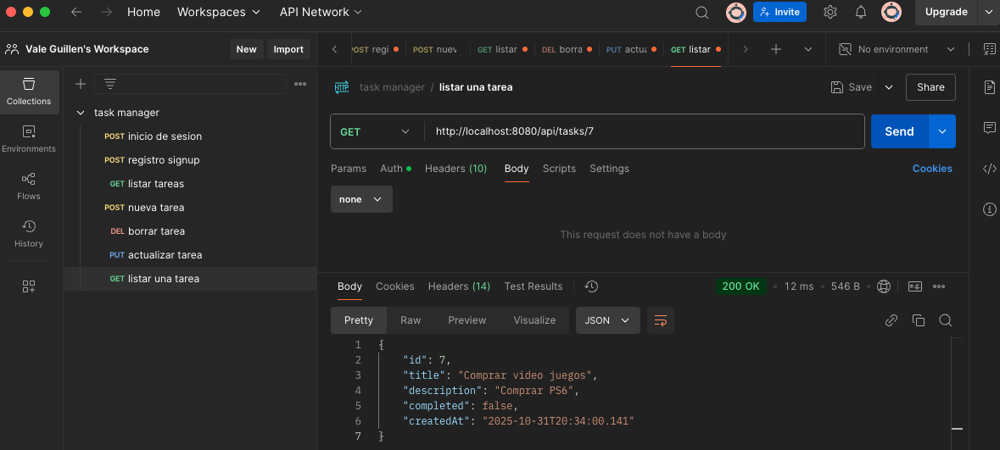
*Ejemplo de consulta exitosa de una tarea específica*

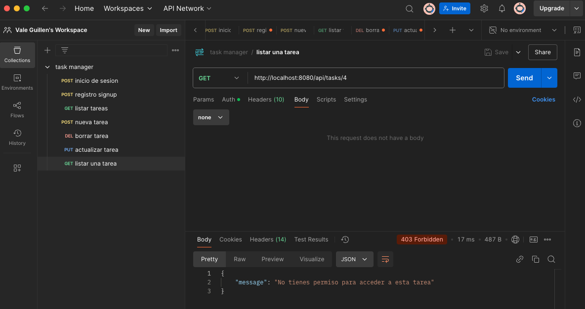
*Ejemplo de error al consultar una tarea sin los permisos adecuados*

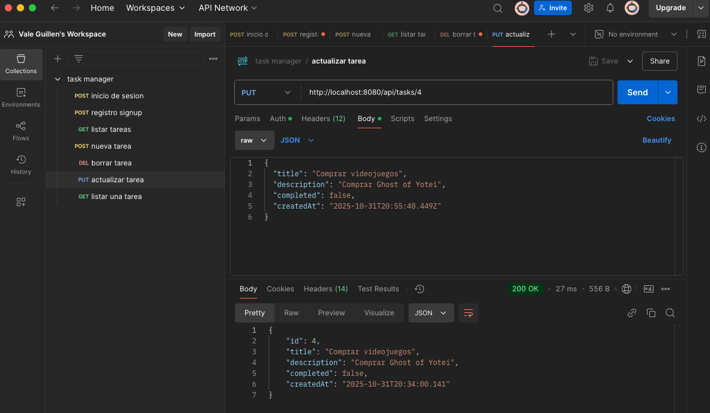
*Ejemplo de actualización exitosa de una tarea*

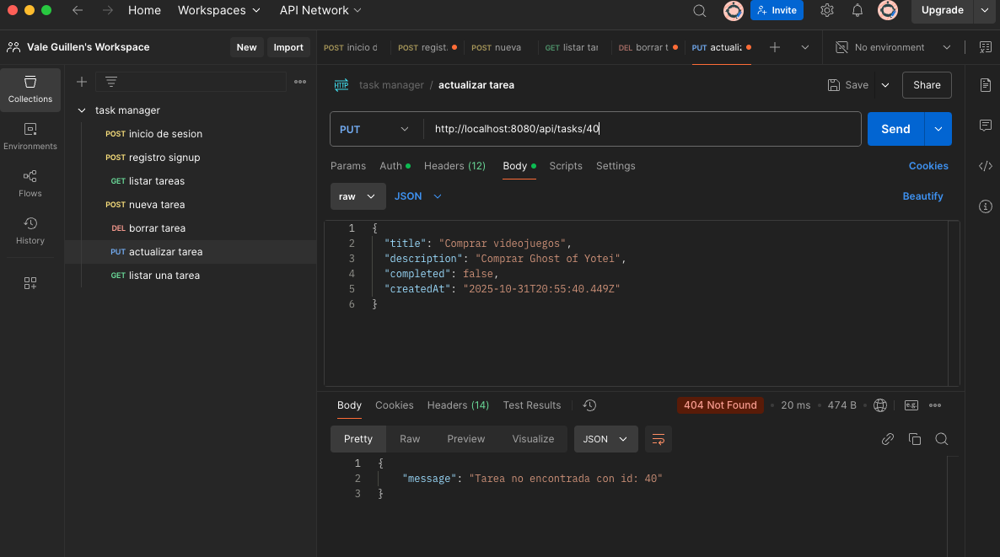
*Ejemplo de error al actualizar una tarea*

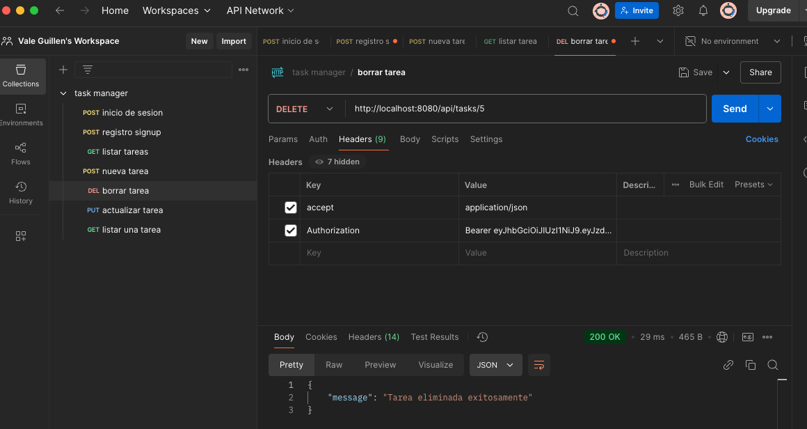
*Ejemplo de eliminación exitosa de una tarea*

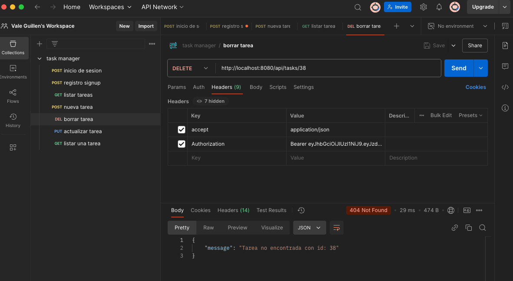
*Ejemplo de error al eliminar una tarea*
